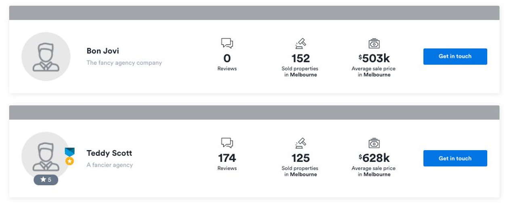

# Front End Code Review

Using the data below and whatever version of angular you prefer, build the following component.



- The button does not need to go anywhere, just trigger a page alert to say it’s been clicked.
- The assets required are attached.
- IsAwardWinner causes the little badge to appear beside the avatar image
- The star rating below the avatar should appear if the value is higher than 2

## Data

```
{
   "Results":[
      {
         "Name":"Bon Jovi",
         "IsAwardWinner":false,
         "Agency":{
            "Name":"The fancy agency company"
         },
         "Theme":{
            "AvatarImage":"pick any image to use as an avatar"
         },
         "AverageSalePrice":502664.13,
         "SoldProperties":152,
         "TotalReviews":0,
         "StarRating":1.0
      },
      {
         "Name":"Teddy Scott",
         "IsAwardWinner":true,
         "Agency":{
            "Name":"A fancier agency"
         },
         "Theme":{
            "AvatarImage":"pick any image to use as an avatar"
         },
         "AverageSalePrice":627586.74,
         "SoldProperties":125,
         "TotalReviews":174,
         "StarRating":5.0
      }
   ]
}
```

## Development server

Run `ng serve` for a dev server. Navigate to `http://localhost:4200/`. The app will automatically reload if you change any of the source files.

## Code scaffolding

Run `ng generate component component-name` to generate a new component. You can also use `ng generate directive|pipe|service|class|guard|interface|enum|module`.

## Build

Run `ng build` to build the project. The build artifacts will be stored in the `dist/` directory. Use the `--prod` flag for a production build.

## Running unit tests

Run `ng test` to execute the unit tests via [Karma](https://karma-runner.github.io).

## Running end-to-end tests

Run `ng e2e` to execute the end-to-end tests via [Protractor](http://www.protractortest.org/).

## Further help

To get more help on the Angular CLI use `ng help` or go check out the [Angular CLI Overview and Command Reference](https://angular.io/cli) page.
